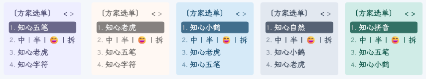

RIME_JK ，指尖上的旋律 ～ [🍕 指南](https://aituyaa.com/rime_jk-%E6%8C%87%E5%B0%96%E4%B8%8A%E7%9A%84%E6%97%8B%E5%BE%8B/)

**折腾输入法有一段时间了，略感疲惫 💤** 

打个标签，放出当前阶段的最后一个具备强通用性的版本 - `v6.6.0.lts+`，可以认为它是 `v6.1.0` 的升级版。新增：

¹ 基于五笔、拼音、英文输入的并击指法方案；  
² 模块化组织的配置方案；   
³ ……

它优化增强了使用体验，修复了一些微不足道的小问题。如果你想要一个配置完备的方案，那这两个版本就比较适合。  

‼🪧 [**Release Version 6.6.0.lts+**](https://github.com/loveminimal/rime-jk/releases/tag/v6.6.0.lts+)

该版本之后的版本，都只保留了个人所需方案和功能，不再具备强通用性（除非你和我的使用习惯一模一样）。预计仅包含：

¹ 仅保留五笔、英文输入方案；    
² 拼音方案仅支持单字反查，不再独立的输入方案；   
³ 精简有趣但也仅限于有趣的脚本、注释；   
⁴ ……

已使用或想要查询该版本的具体内容，可以直接下载或点击 [v6.6.0.lts+](https://github.com/loveminimal/rime-jk/tree/v6.6.0.lts+) ~

‼🪧 [**Release Version 6.1.0**](https://github.com/loveminimal/rime-jk/releases/tag/v6.1.0)

该版本是一个功能完善的版本：

包含多种输入方案：五笔、虎码、小鹤、鹤形、自然码、全拼；  
包含多种辅助码方案：墨奇、小鹤、自然码、五笔前二、虎码首末、汉心等。 
 
